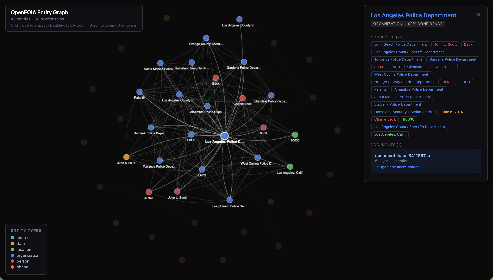
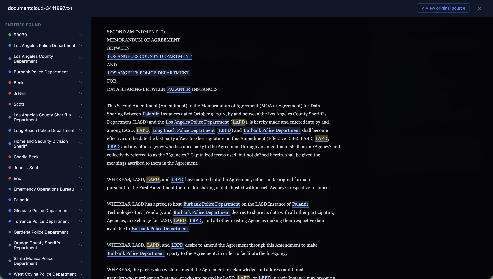

# OpenFOIA

**Local-first investigation toolkit for journalists, researchers, and citizens.**

Your data never leaves your machine. Works offline. Works everywhere.

*One real government document → 45 entities, 166 relationships, extracted locally in seconds. No cloud. No API keys.*





---

## Install

```bash
curl -fsSL https://raw.githubusercontent.com/JordanCoin/openfoia/main/install.sh | bash
```

Works on Linux, macOS, and Windows (WSL).

New to OpenFOIA? Run `openfoia guide` after installing.

## What It Does

File FOIA requests. Analyze documents. Extract entities. Build relationship graphs. Cross-reference against public databases. All locally, all offline, all purgeable.

```bash
openfoia init                                          # 53 federal agencies pre-loaded
openfoia records search "EPA water" --source muckrock       # search 46k+ completed FOIA requests
openfoia records search "Palantir" --source documentcloud  # search 10M+ public documents
openfoia records fetch 3411897 --source documentcloud      # pull full text into local database
openfoia records download 68490 --ingest                   # download + ingest response documents
openfoia analyze extract <doc-id>                          # extract people, orgs, money, dates
openfoia analyze graph --name investigation --view         # interactive graph + document reader
openfoia crossref                                          # check entities against 6 public databases
```

## Features

| | |
|---|---|
| **PDF text extraction** | Compiled 1.1MB binary. 99.5% accuracy across 480K chars. Zero dependencies. |
| **Entity extraction** | 4-tier: LLM → GLiNER → spaCy → Regex. 100% recall with a 2GB local model |
| **Relationship graphs** | Interactive graph with built-in document reader. Click entities to read source text with highlights |
| **Cross-reference** | MuckRock, DocumentCloud, OpenCorporates, SEC EDGAR, OpenSanctions, ICIJ Offshore Leaks |
| **File requests** | Email, fax (Twilio), physical mail (Lob) to 53 federal agencies |
| **Data interchange** | Import/export FollowTheMoney format (Aleph, OpenAleph, OpenSanctions) |
| **Encrypted storage** | SQLCipher AES-256. Decoy profile mode |
| **Forensic purge** | 3-pass overwrite, shell history scrub, free space fill |
| **Portable mode** | `openfoia portable` — everything stays on the USB, nothing on the host |
| **Metadata stripping** | Auto-strips EXIF, PDF author, DOCX revision history on ingest |

### PDF Extraction Engine

A compiled 1.1MB binary extracts text directly from PDF structures — no OCR needed for born-digital documents. Uses a multi-level resolution cascade to handle broken fonts, missing encodings, and government form PDFs that other tools can't read.

99.5% accuracy across 480K characters in 50 test PDFs. 100% on every FOIA document tested. Zero runtime dependencies. Falls back to OCR (Tesseract) for scanned documents.

## Data Sources

| Source | What | Auth |
|--------|------|------|
| [MuckRock](https://www.muckrock.com/) | 46k+ completed FOIA requests with downloadable documents | Free |
| [DocumentCloud](https://www.documentcloud.org/) | 10M+ public documents with pre-extracted text | Free |
| [OpenCorporates](https://opencorporates.com/) | Global company ownership, directors, filings | Free |
| [SEC EDGAR](https://www.sec.gov/edgar/) | US corporate filings | Free |
| [OpenSanctions](https://opensanctions.org/) | Sanctions lists, politically exposed persons | Free (non-commercial) |
| [ICIJ Offshore Leaks](https://offshoreleaks.icij.org/) | Panama/Pandora/Paradise Papers (local CSV) | Free download |

## Documentation

| Guide | What |
|-------|------|
| **[Journalist Guide](docs/GUIDE.md)** | Full walkthrough — start here if you're new |
| [Tails OS](docs/TAILS.md) | Running from Tails for maximum privacy |
| [USB Install](docs/USB.md) | Encrypted USB portable setup |
| [Air-Gapped](docs/AIRGAP.md) | Offline deployment overview |

## Privacy

Everything runs on `127.0.0.1`. Token-authenticated. Encrypted at rest (optional). Forensically purgeable. Works offline. Open source.

**For sensitive investigations:** `openfoia serve --tor`

**Portable mode:** `openfoia portable` — data stays on the USB, nothing touches the host.

**When you're done:** `openfoia purge --secure --yes`

## Uninstall

```bash
curl -fsSL https://raw.githubusercontent.com/JordanCoin/openfoia/main/uninstall.sh | bash
```

## Legal Context for Contributors

**Writing this code is legal.** The US DOJ stated in August 2025: ["Merely writing code, without ill intent, is not a crime."](https://www.crowdfundinsider.com/2025/08/248043-us-department-of-justice-signals-shift-in-crypto-enforcement-writing-code-is-not-a-crime/) Open source encryption is [exempt from US export controls](https://www.eff.org/deeplinks/2019/08/us-export-controls-and-published-encryption-source-code-explained). The Tor Project, Signal, SecureDrop, and Tails set the precedent. [More context](https://www.linuxfoundation.org/resources/publications/understanding-us-export-controls-with-open-source-projects).

## Credits

Built by people who believe in freedom of information. Inspired by [MuckRock](https://www.muckrock.com/), [DocumentCloud](https://www.documentcloud.org/), and the [Reporters Committee for Freedom of the Press](https://www.rcfp.org/).

## License

AGPL-3.0 — Keep it open.

---

*"Democracy dies in darkness. FOIA is how we turn on the lights."*
